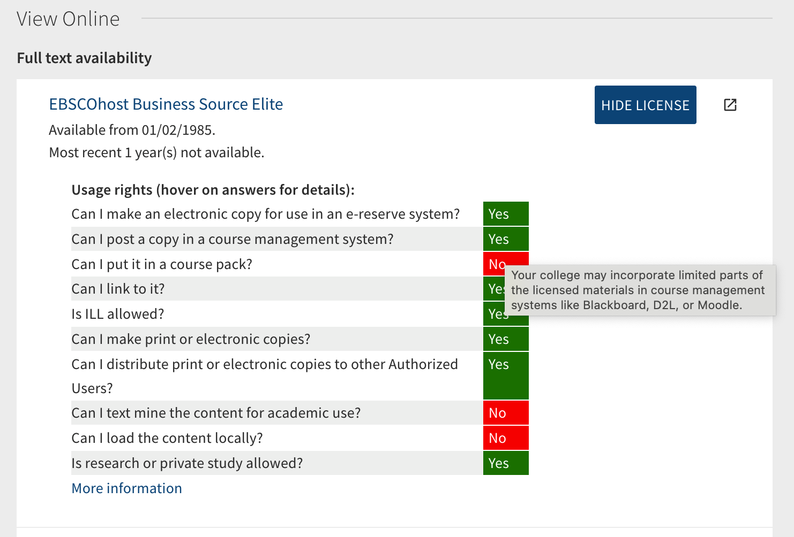
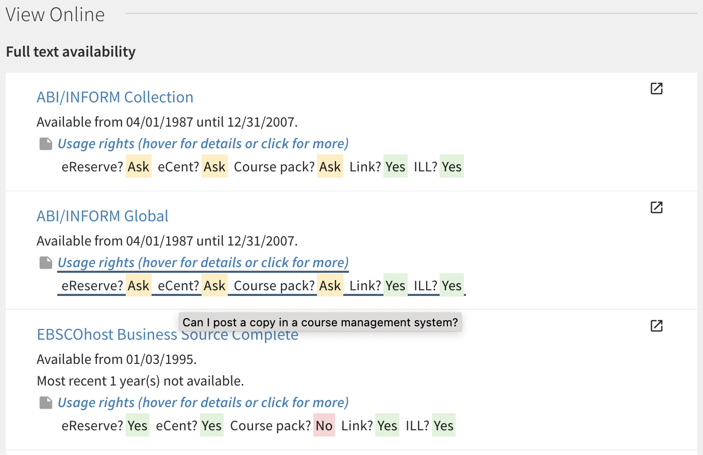

# Display CLEAR/OUR permitted uses in Primo

This is module dynamically replaces hyperlinks to permitted uses records managed by
the [OCUL Usage Rights (OUR) service](https://learn.scholarsportal.info/all-guides/our/)
(rebranded as CLEAR for Ontario colleges) with a visual summary.

Once enabled, permitted uses information pulled from CLEAR/OUR are displayed within Primo's "Show License"
toggle for each electronic resource referenced in CLEAR/OUR:



Alternatively, you can opt for a shorter format and display it directly underneath each View It item (inside the Public Note field):



## How it works

This module works by identifying links to CLEAR/OUR records provided in the Public Note for a collection. More specifically,
it is looking for URLs with the format 

```
https://<clear|ocul>.scholarsportal.info/<institution>/<product>
```

For each link
like this, the module then sends a request to the CLEAR/OUR API for that record and displays the response visually on Primo.

If you opt for the default display (inside the Primo "Show License" toggle), the information pulled from CLEAR/OUR **replaces**
any permitted uses information provided by the Alma record.

## How to enable the module

### Using the Primo development environment

If you are using the [Primo VE development environment](https://github.com/ExLibrisGroup/primo-explore-devenv),
you can download this repository inside the `js` folder at the root of your view directory
and add something like this to your `main.js` file:

```JavaScript
import './ocls-clear-display/ocls-clear-display.module.js';

var app = angular.module('viewCustom', ['angularLoad', 'oclsClearDisplay']);
```

### Manually editing your view directory

If you are editing the files in your view directory but not using the development environment, you can also copy
the content of [`ocls-clear-display.module.js`](ocls-clear-display.module.js) to your `custom.js` file.

Make sure to add this content *after* the following lines

```JavaScript
(function () {
  'use strict';
  'use strict';
  
  /* Paste the module contents here */
```

and *before* the one that looks like this

```JavaScript
var app = angular.module('viewCustom', ['angularLoad', 'oclsClearDisplay']);
```

Then, make sure to add `'oclsClearDisplay'` inside the module definition on that line. You may already have other modules
referenced there, just add this one to the list.


### CSS

You will also need to add [the CSS snippet included](clear.css) to your `custom.css` file. You can customize it to vary
colours, text size, etc.

#### A note on accessibility

The colours of the text and background for the "Yes/No/Ask" boxes in the provided CSS were chosen to have a contrast ratio
of at least 4.5:1 as per [WCAG 2.0](https://www.w3.org/WAI/WCAG21/quickref/?versions=2.0#contrast-minimum):

* "Yes": #212121 on #e7f4e4 (contrast ratio 14.2:1)
* "No": #212121 on #f9dede (contrast ratio 12.7:1)
* "Ask": #212121 on #fff1d2 (contrast ratio 14.4:1)

## Custom settings

Edit the contents of `oclsClearDisplayConfig` according to your needs:

Property | Effect
---------|-------
`compact_display` | Set this to `true` to display a compact version of the usage rights, similar to the old "SFX" CLEAR/OUR display. Short text for each individual permission is set in the `terms` object (see below).
`hover_text` | Set this to `true` to add a hover effect with the full response text over the brief response. When using the `compact_display` setting, this also adds the full question text over the user defined short text.
`display_in_note` | When set to `true`, the permitted uses are displayed inside the Primo Public Note for each database. When omitted or set to `false`, permitted uses obtained from CLEAR/OUR instead replace the built-in Primo terms display and the user can display them by clicking the "Show Licence" button. Note that when `display_in_note` is enabled, permitted uses are **always displayed** (no user click required).
`title_text` | Defines what text is to be displayed above the permitted uses table. This value can contain basic HTML tags to control appearance.
`footer_text` | Defines what text is to be displayed underneath the permitted uses table. When `display_in_note` is not enabled, this text is wrapped with a hyperlink to the full CLEAR/OUR record.
`local_instance` | This value can be set to a custom OUR instance name to **override** the one in the original URL. See note below regarding CLEAR Local override.
`terms` | A dictionary of objects for each permission term supplied by CLEAR/OUR. For each term, you can define the following two properties:
`short_text`| Set this value to the short text you want to display when using the `compact_display` mode (see above).
`hide` | Set this to true if you want to hide a particular term from the display.

The text of the "Show License"/"Hide License" button can be customized in the ViewIt Labels table within the Alma backend. Alter the description
for the following codes: `c.uresolver.viewit.license.show_license` and `c.uresolver.viewit.license.hide_license`.

### CLEAR Local override

In the case of the Ontario colleges, CLEAR URLs are provided by OCLS for all consortial resources. Colleges who have opted to use the CLEAR Local service,
can in addition manage their own CLEAR instance and add their own URLs to local resources in their Institution Zone. However, the URLs provided by OCLS on
consortial resources will retrieve CLEAR Central records for those resources, while CLEAR Local colleges may want their own records to be displayed instead.

This can be achieved by setting the `local_instance` variable in the configuration array to the name of their instance. Setting this variable will
**override** the instance name in **all** CLEAR links found by the module.

Note that currently there is no fallback to this override method. If no CLEAR Local record exists for a resource, permitted uses will not be displayed,
even if a CLEAR Central record exists!

## Credits

This module was inspired by the [University of Guelph OUR integration code](https://gitlab.com/ug-library/primo-explore-ocul-docker). 

The functions to convert XML to JSON included in this module were inspired by 
[this snippet by Visnu Pitiyanuvath](https://observablehq.com/@visnup/xml-to-json).

Colour values in the provided CSS come from the [Carnegie Museum of Pittsburgh Web Accessibility Guidelines colour palette](http://web-accessibility.carnegiemuseums.org/design/color/).