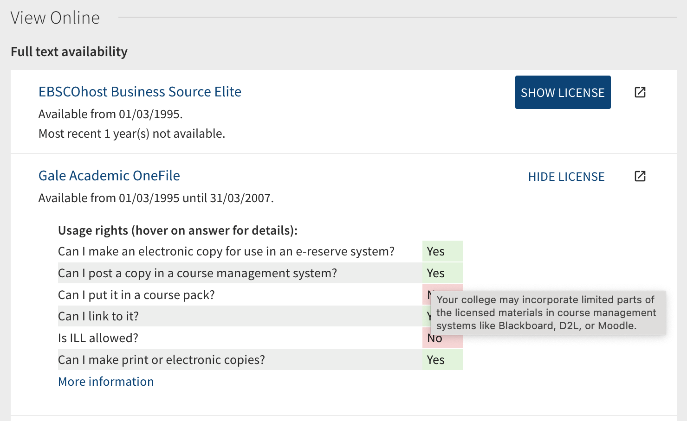

## Display CLEAR/OUR permitted uses in Primo - EXPERIMENTAL

This is an **experimental** module to dynamically replace hyperlinks to permitted uses records managed by
the OCUL Usage Rights (OUR) service (rebranded as CLEAR for Ontario colleges) with a visual summary.

Once enabled, electronic resources in your catalog should look like this:



### How to enable the module

To enable this module, download this repository inside the `js` folder at the root of your view directory
and add something like this to your `custom.js` (or `main.js`) file:

```JavaScript
import './ocls-clear-display/ocls-clear-display.module.js';

var app = angular.module('viewCustom', ['angularLoad', 'oclsClearDisplay']);
```

Make sure that both `ocls-clear-display.module.js` and `ocls-clear-display.config.js` are inside the same repository or
the module will not work.

You will also need to add the CSS snippet included to your `custom.css` file.

### Custom settings

Edit the contents of the `ocls-clear-display.config.js` according to your needs.

Variable | Effect
---------|-------
`compact_display` | Set this to `true` to display a compact version of the usage rights, similar to the old "SFX" CLEAR/OUR display. Short text for each individual permission is set in the `terms` object (see below).
`hover_text` | Set this to `true` to add a hover effect with the full response text over the brief response. When using the `compact_display` setting, this also adds the full question text over the user defined short text.
`display_in_note` | When set to `true`, the permitted uses are displayed inside the Primo Public Note for each database. When omitted or set to `false`, permitted uses obtained from CLEAR/OUR instead replace the built-in Primo terms display and the user can display them by clicking the "Show Licence" button. Note that when `display_in_note` is enabled, permitted uses are **always displayed** (no user click required).
`title_text` | Defines what text is to be displayed above the permitted uses table. This value can contain basic HTML tags to control appearance.
`footer_text` | Defines what text is to be displayed underneath the permitted uses table. When `display_in_note` is not enabled, this text is wrapped with a hyperlink to the full CLEAR/OUR record.
`terms` | A dictionary of objects for each permission term supplied by CLEAR/OUR. For each term, you can define the following two variables:
`short_text`| Set this value to the short text you want to display when using the `compact_display` mode (see above).
`hide` | Set this to true if you want to hide a particular term from the display.
